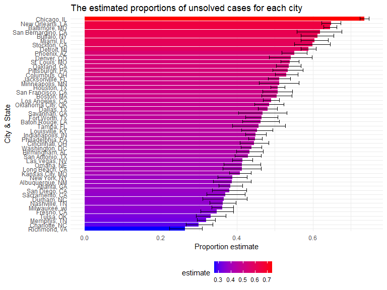
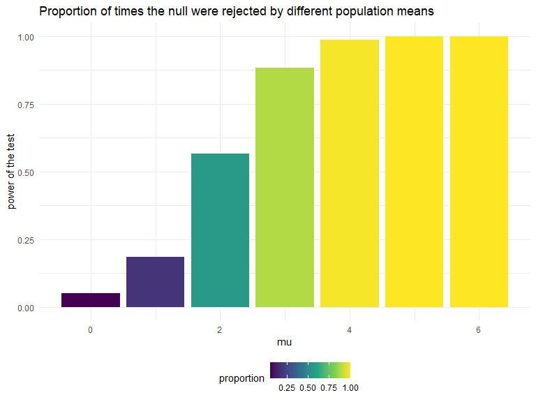
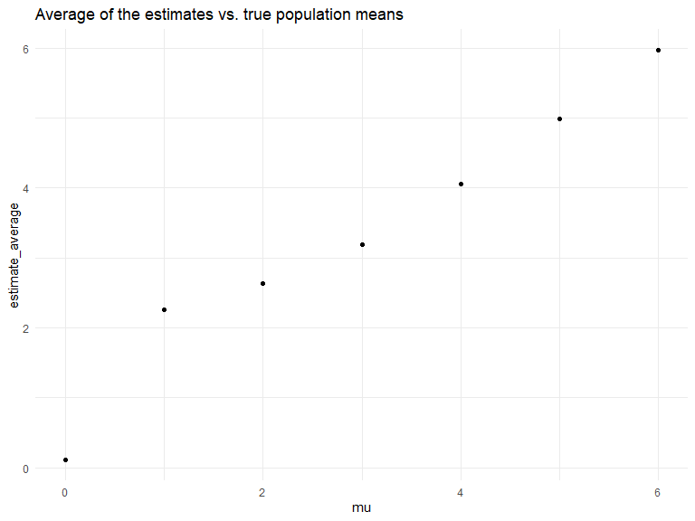

HW5
================
Xuesen Zhao
2022-11-09

``` r
library(tidyverse)
```

    ## ── Attaching packages ─────────────────────────────────────── tidyverse 1.3.2 ──
    ## ✔ ggplot2 3.3.6      ✔ purrr   0.3.4 
    ## ✔ tibble  3.1.8      ✔ dplyr   1.0.10
    ## ✔ tidyr   1.2.1      ✔ stringr 1.4.1 
    ## ✔ readr   2.1.2      ✔ forcats 0.5.2 
    ## ── Conflicts ────────────────────────────────────────── tidyverse_conflicts() ──
    ## ✖ dplyr::filter() masks stats::filter()
    ## ✖ dplyr::lag()    masks stats::lag()

``` r
library(ggridges)
library(purrr)
knitr::opts_chunk$set(
    echo = TRUE,
    warning = FALSE,
    fig.width = 8, 
  fig.height = 6,
  out.width = "90%"
)

theme_set(theme_minimal() + theme(legend.position = "bottom"))

options(
  ggplot2.continuous.colour = "viridis",
  ggplot2.continuous.fill = "viridis"
)

scale_colour_discrete = scale_colour_viridis_d
scale_fill_discrete = scale_fill_viridis_d
```

## Question 1

## Question 2

``` r
homicides = read_csv("./data/homicide_data.csv") %>%
  janitor::clean_names() 
```

    ## Rows: 52179 Columns: 12
    ## ── Column specification ────────────────────────────────────────────────────────
    ## Delimiter: ","
    ## chr (9): uid, victim_last, victim_first, victim_race, victim_age, victim_sex...
    ## dbl (3): reported_date, lat, lon
    ## 
    ## ℹ Use `spec()` to retrieve the full column specification for this data.
    ## ℹ Specify the column types or set `show_col_types = FALSE` to quiet this message.

The raw data was collected by Washington Post on over 52,000 criminal
homicides over the past decade in 50 of the largest cities in the U.S.
The original data set contained 52179 rows and 12 columns. The features
included the case id, reported date, the first and last name of the
vicitim, as well as the race, age, and gender of the victim. It also
contained variables that describe the location of homicides, and the
disposition.

``` r
homicides %>%
  mutate(
    city_state = str_c(city,state,sep= ", ")
  ) %>%
  group_by(city_state) %>%
  summarize(
    solved_cases = sum(disposition == "Closed by arrest"),
    unsolved_cases = sum(disposition != "Closed by arrest")
  )
```

    ## # A tibble: 51 × 3
    ##    city_state      solved_cases unsolved_cases
    ##    <chr>                  <int>          <int>
    ##  1 Albuquerque, NM          232            146
    ##  2 Atlanta, GA              600            373
    ##  3 Baltimore, MD           1002           1825
    ##  4 Baton Rouge, LA          228            196
    ##  5 Birmingham, AL           453            347
    ##  6 Boston, MA               304            310
    ##  7 Buffalo, NY              202            319
    ##  8 Charlotte, NC            481            206
    ##  9 Chicago, IL             1462           4073
    ## 10 Cincinnati, OH           385            309
    ## # … with 41 more rows

The above table showed the number of solved homicides (with the
disposition being “Closed with arrest”) and the number of unsolved
homicides (with the dispositions of “Closed without arrest” or “Open/No
arrest”) by each city.

``` r
Baltimore_summary = homicides %>%
  mutate(
    city_state = str_c(city,", ",state)
  ) %>%
  group_by(city_state) %>%
  summarize(
    solved_cases = sum(disposition == "Closed by arrest"),
    unsolved_cases = sum(disposition != "Closed by arrest"),
    n = n()
  ) %>%
  filter(city_state == "Baltimore, MD") 

Baltimore_test = prop.test(
  x = Baltimore_summary %>% pull(unsolved_cases),
  n = Baltimore_summary %>% pull(n)
          ) 
  
broom::tidy(Baltimore_test) %>% 
  select(estimate,conf.low,conf.high)
```

    ## # A tibble: 1 × 3
    ##   estimate conf.low conf.high
    ##      <dbl>    <dbl>     <dbl>
    ## 1    0.646    0.628     0.663

The estimated proportion of unsolved cases is 0.6455607 and the
confidence interval is (0.6275625,0.6631599).

``` r
unsolved_all = homicides %>%
  mutate(
    city_state = str_c(city,", ",state)
  ) %>%
  group_by(city_state) %>%
  filter(city_state != "Tulsa, AL") %>%
  summarize(
    unsolved_cases = sum(disposition != "Closed by arrest"),
    city_n = n()
  ) %>%
  mutate(
    prop_test = map2(.x = unsolved_cases, .y = city_n, ~prop.test(x = .x, n= .y)),
    tidy_test = map(.x = prop_test, ~broom::tidy(.x))
  ) %>%
  unnest(tidy_test) %>%
  select(city_state,estimate,conf.low,conf.high)
```

``` r
ggplot(unsolved_all, aes(x=reorder(city_state, +estimate), y = estimate, fill = estimate))+ geom_bar(stat="identity")+geom_errorbar(aes(ymin = conf.low, ymax=conf.high))+labs(title = "The estimated proportions of unsolved cases for each city", x = "City & State", y = "Proportion estimate")+coord_flip()+scale_fill_gradient(low="blue",high="red")
```



Since Tulsa, AL had only 1 case, which was a solved case. We excluded it
from the proportion test. Moreover, there is no city in Alabama that is
called Tulsa, so it is probably a misinformation that should be removed.

## Question 3

``` r
sim_result_df = 
  expand_grid(
  sample_size = 30,
  iteration = 1:5000,
  mu = 0:6
) %>%
  mutate(
    norm_df = map2(.x = sample_size, .y = mu, ~rnorm(n = .x, mean = .y, sd = 5))
  ) %>%
  mutate(
    t_test = map(.x = norm_df, ~t.test(x = .x)),
    tidy_test = map(.x = t_test, ~broom::tidy(.x))
  ) %>%
  unnest(tidy_test) %>%
  select(iteration, sample_size, mu, estimate, p.value)
```

``` r
sim_result_df %>%
  group_by(mu) %>%
  summarize(
    n_rejected = sum(p.value <0.05),
    n_total = n(),
    proportion = n_rejected/n_total
  ) %>% 
  ggplot(aes(x=mu,y=proportion,fill = proportion))+geom_bar(stat="identity")+labs(title="Proportion of times the null were rejected by different population means", y = "power of the test")
```



As shown by the above graph, the larger the difference between the true
population mean and our null, the higher the proportion of times the
null was rejected. In other words, as effect size increases, the power
also increases.

``` r
sim_result_df %>%
  filter(p.value < 0.05) %>%
  group_by(mu) %>%
  summarize(
    estimate_average = mean(estimate)
  ) %>%
  ggplot(aes(x = mu, y = estimate_average))+geom_point()+labs(title = "Average of the estimates vs. true population means")
```



As shown in the above graph, the sample average of $\hat \mu$ across
test for which the null is rejected is approximately equal to the true
value of $\mu$ as $\mu$ increases beyond 3. The average of $\hat \mu$ is
very different from the true population mean when $\mu$ is equal to 1 or
2. This is because the power of the test increases as the effect size
increases, so we would expect a better approximation to the true value
of $\mu$ based on our estimate average.
